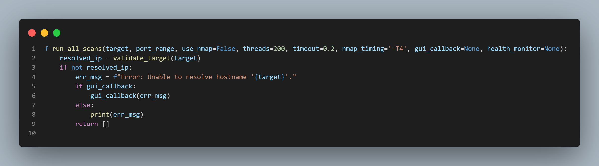
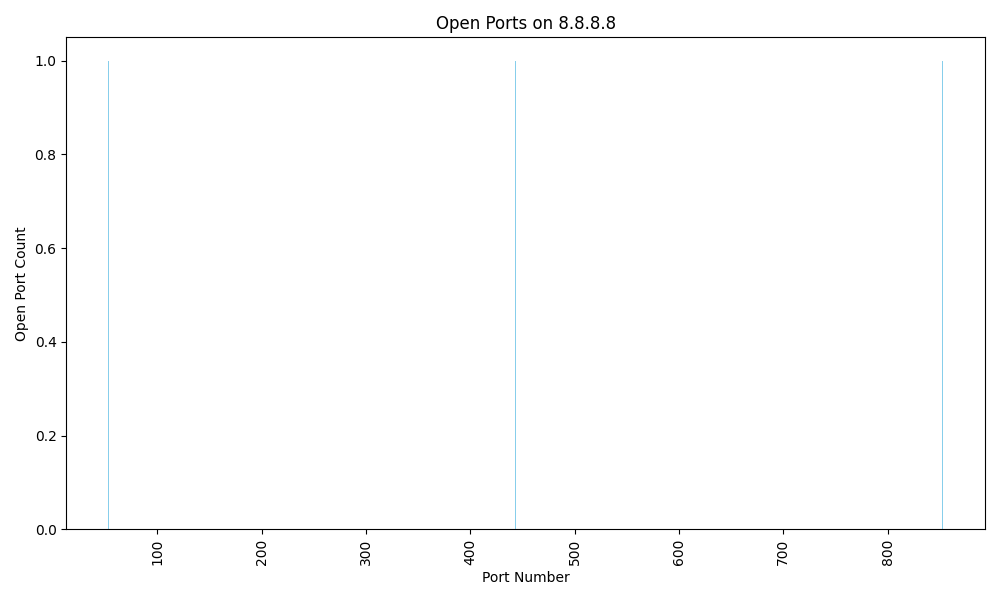

# Network Scanner GUI
Advanced network security tool with ping sweep, port scanning & encrypted reporting.

## 🚀 Features
- **Ping sweep** - Discover live hosts
- **Port scanning** - Detect open services
- **Encryption** - AES-256 scan results
- **GUI interface** - tkinter-based
- **Export formats** - CSV, HTML, JSON
- **Charts** - Open ports visualization
- **System health** monitoring

## 🛠️ Tech Stack
- **Core**: Python 3, socket, threading
- **GUI**: tkinter
- **Encryption**: cryptography (AES-256)
- **Charts**: matplotlib
- **Executable**: PyInstaller

## 📸 Demo

## 🚀 Quick Start
pip install -r requirements.txt
python gui.py

## 📁 Outputs
├── scan_results.csv/html/json
├── encrypted scans (.json.enc)
└── charts/.png
